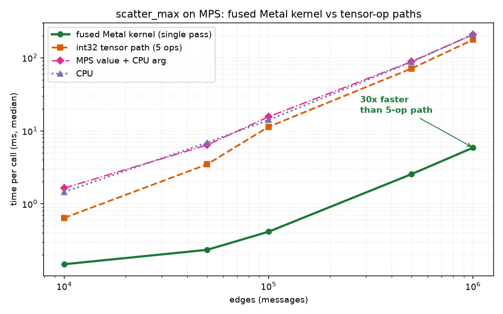
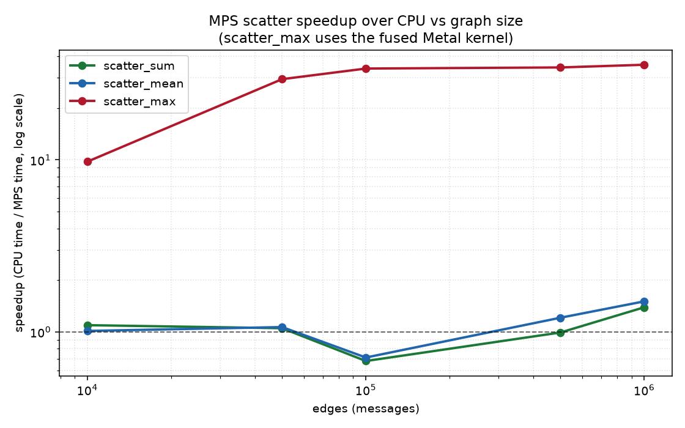

# Scatter-Family MPS Benchmark Report

This report measures the `pyg-lib` scatter operators on Apple Silicon. The
headline result is the **fused Metal kernel** for `scatter_min`/`scatter_max`,
which computes the reduced value **and** its arg index in a single atomic pass,
replacing a five-op tensor sequence (scatter_reduce, gather, eq, where,
scatter_reduce).

## Setup

| Item | Value |
|------|-------|
| Platform | macOS 26.5.1, Apple M4 Pro (Apple9 GPU family), Metal 4 |
| PyTorch | 2.12.1 |
| `pyg-lib` | 0.8.0 (local source build, MPS patches applied) |
| Feature dim | 64 |
| Workload | `edges` messages aggregated into `edges / 10` nodes |
| Timing | warmup 20, 100 iters, `torch.mps.synchronize()` around each call, median reported |

Reproduce with:

```bash
./scripts/uv_stage.sh benchmark   # writes benchmarks/results.json
./scripts/uv_stage.sh report      # writes the PNGs below
```

## Result 1 — the fused Metal kernel

`scatter_min`/`scatter_max` need both a reduced value and the source index that
produced it. MPS has no int64 `scatter_reduce`, so earlier iterations computed
the arg index either through a CPU round-trip or through an on-device int32
sequence of five generic kernels. The fused kernel instead packs an
order-preserving `uint` transform of the value in the high 32 bits and the
complemented source position in the low 32 bits of a 64-bit word, then does one
`atomic_max` per element. A cheap second kernel unpacks the keys. Ties resolve to
the first occurrence (matching the CPU kernel) because the complemented position
makes the smallest index win.



| edges | fused Metal (ms) | int32 5-op (ms) | speedup | CPU (ms) | vs CPU |
|------:|-----------------:|----------------:|--------:|---------:|-------:|
| 10,000 | 0.149 | 0.642 | 4.3× | 1.455 | 9.8× |
| 50,000 | 0.234 | 3.476 | 14.9× | 6.894 | 29× |
| 100,000 | 0.416 | 11.360 | 27× | 14.087 | 34× |
| 500,000 | 2.553 | 71.380 | 28× | 87.809 | 34× |
| 1,000,000 | 5.885 | 177.059 | **30×** | 209.769 | **36×** |

**Reading:** the fused kernel is **4–30× faster than the previous native path**
and **10–36× faster than CPU**, with the gap widening as the graph grows because
the fused kernel makes one pass over the source instead of five and avoids the
generic `scatter_reduce` machinery entirely. At 1M edges it reduces a 177 ms
operation to under 6 ms. Correctness (value **and** arg, including tie-breaking
under heavy atomic contention) is verified against the CPU kernel and
`torch_scatter` in `tests/test_scatter_parity.py`.

The kernel covers the message-passing hot path: 2-D `src` in float32, **float16,
or bfloat16**, `dim == 0`, and a column-broadcast index (what PyG produces from a
1-D edge index). Half/bfloat inputs are promoted to float32 inside the shader
(bf16 via a bit shift, avoiding any dependency on Metal's bfloat type) and the
result is written back in the native dtype -- losslessly, since the value came
from an actual source element. fp16/bf16 therefore match the CPU kernel
**exactly** (value and arg) and see the same speedup: ~29-36x over the tensor
path at 100k-1M edges. Only `dim != 0` or a genuine (non-broadcast) 2-D index
now fall back to the portable int32 tensor path.

## Result 2 — hand-written kernel vs relying on generic ops



| edges | sum MPS/CPU (ms) | mean MPS/CPU (ms) | max (fused) MPS/CPU (ms) |
|------:|-----------------:|------------------:|-------------------------:|
| 10,000 | 0.77 / 0.33 | 0.60 / 0.36 | 0.149 / 1.455 |
| 100,000 | 4.79 / 3.24 | 4.91 / 3.15 | 0.416 / 14.087 |
| 1,000,000 | 60.30 / 85.67 | 61.01 / 99.71 | 5.885 / 209.769 |

**Reading:** `scatter_sum`/`scatter_mean` use PyTorch's native `scatter_add_`
kernel and only edge past CPU beyond ~500k edges (1.4–1.6× at 1M). The fused
`scatter_max` kernel, by contrast, is 10–36× faster than CPU across the whole
range. The lesson is concrete: on MPS, relying on generic reductions leaves most
of the GPU on the table; a purpose-built kernel for the hot path is where the
win is.

## Other operators — where a Metal kernel is (and isn't) worth it

- **`scatter_sum` / `scatter_mul` / `scatter_mean`:** already dispatch to
  PyTorch's native MPS `scatter_add_` / `scatter_reduce_`, which are single
  optimized kernels. A hand-written atomic-add kernel would contend with
  PyTorch's own implementation for little gain (and float atomic-add contention
  can be worse), so these are left on the native path.
- **`scatter_min` / `scatter_max`:** the clear win — a fused Metal kernel,
  shipped here.
- **Point-cloud (`knn`, `radius`, `fps`, ...) and spline ops:** remain
  CPU-assisted. They are preprocessing, called rarely, and a Metal port would
  require spatial data structures for a fraction of the benefit the scatter hot
  path delivers. Deferred by design, not by omission.

## Next steps

- Widen the fast path to `dim != 0` and genuine 2-D index tensors.
- A fused segment-CSR max could give the same treatment to sorted-index paths.
